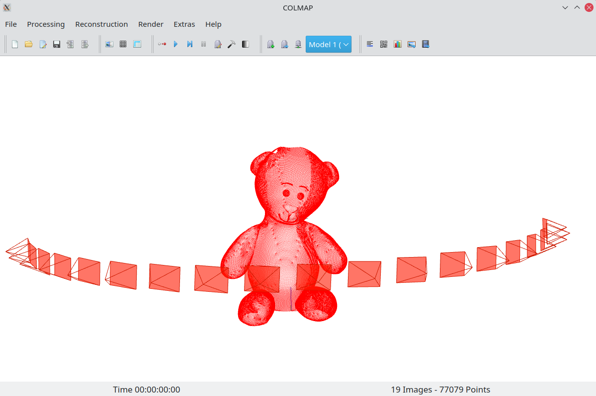

[](https://opensource.org/licenses/MIT)
[](https://www.blender.org/download/)
[](http://colmap.github.io/)

Export SLAM data 3D data from a blender scene in COLMAP format. This data can be used as the reference or ground truth for a variety of computer vision applications: 3d reconstruction, structure-from-motion, SLAM, tracking and many more. The add-on supports the export of **3d vertices**, **2d projections**, **camera poses**, and **camera intrinsic** parameters.

Evaluating the performance of 3d reconstruction or SLAM is not an easy task. The ground truch is often collected using special motion capture systems or LiDARs and it still not perfect. Using a rendering software, such as Blender, allows creating pefrect data, where the occlusions are already taken into account, for an arbitrary scene, with an arbitrary camera or a set of cameras, and for an arbitrary camera motion. For free!

### Example

Original render (left) <=> Original with projected vertices (right)


The data exported by the add-on and imported in COLMAP-gui



The original `*.blend` scene as well as the exported data can be found in the [examples folder](https://github.com/avkudr/blender_slam_data_export/tree/main/examples/blender_guru_teddy_bear) folder. The model was downloaded from this [BlenderGuru tutorial](https://www.youtube.com/watch?v=Ebx2qbBlvh0&ab_channel=BlenderGuru).
## Install


### 1. Download the add-on

### 2. Install the add-on

## Usage

- output same as for rendering
- only active camera
- only the frames selected in rendering pane
- freezes during export

## Output format

The calibration is provided in the [format](http://colmap.github.io/format.html) of the [COLMAP](http://colmap.github.io/) Structure-from-Motion program. Camera intrinsics are given in a text file [cameras.txt](http://colmap.github.io/format.html#cameras-txt), while image extrinsics are given in a text file [images.txt](http://colmap.github.io/format.html#images-txt).

Keypoints and matches (projections of mesh vertices) are given in [images.txt](http://colmap.github.io/format.html#images-txt). 3d points, that correspond to the mesh vertices themselves, are given in [points3D.txt](http://colmap.github.io/format.html#points3d-txt) file.

Note that COLMAP format can be used in [MATLAB](https://github.com/colmap/colmap/blob/master/scripts/matlab/read_model.m), [Python](https://github.com/colmap/colmap/blob/dev/scripts/python/read_write_model.py), and [c++](https://github.com/colmap/colmap/blob/dev/src/base/reconstruction.h). In addition to that, this format can be used in [openMVG](https://github.com/openMVG/openMVG/blob/develop/src/software/SfM/import/io_readGTETH3D.hpp)

Example forder structure:
```
/output/dir/
   images/
      image_0.png
      image_1.png
      ...
   cameras.txt
   images.txt
   points3D.txt
```

## Acknowledgement

### 3D models

`blender_guru_teddy_bear.blend` is part of the [BlenderGuru tutorial](https://www.youtube.com/watch?v=Ebx2qbBlvh0&ab_channel=BlenderGuru) on youtube. This model was used to create images on the from page. Inside `blender_guru_teddy_bear` folder, you will find the blender file, and the SLAM data exported from it. The materials used are from [poliigon](https://www.poliigon.com/).

`debug_pokemons.blend` scene was used for add-on debugging and the contains the [model](https://www.thingiverse.com/thing:1727376) downloaded from [thingiverse](www.thingiverse.com) 